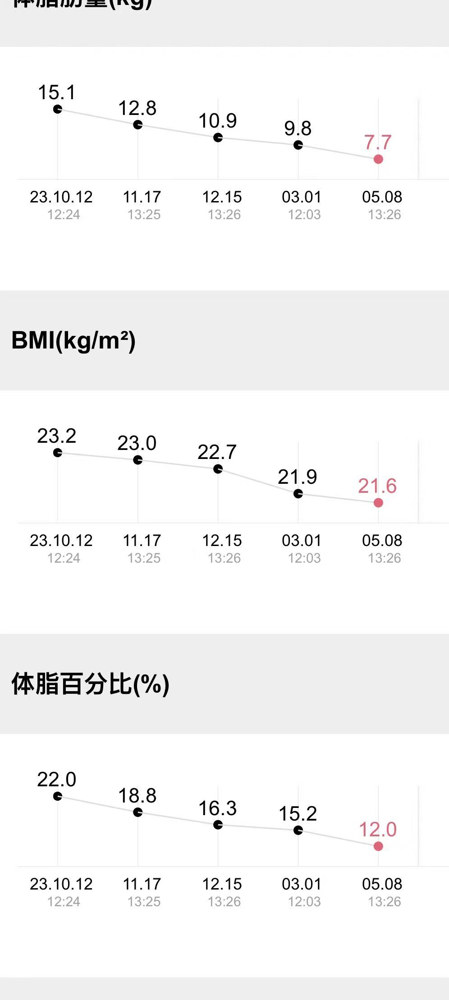
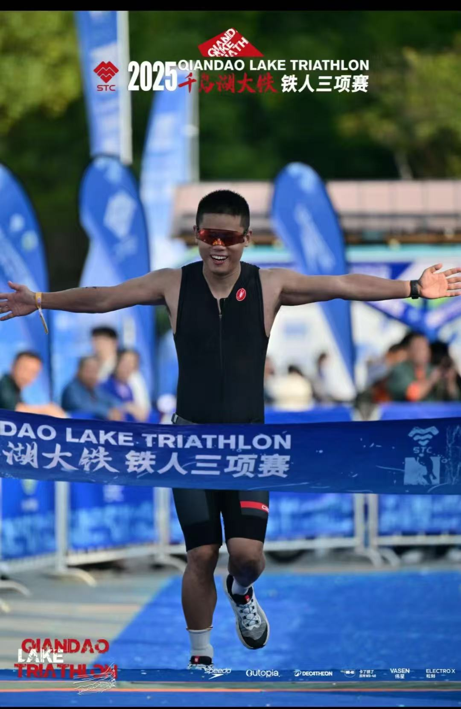

# 从一张体检报告，到 113 公里铁三：懒猫君作者的运动人生

我和运动的故事，起源于一张体检报告。

大概是工作的第四年，我在某书上班。工作节奏很快，经常熬夜修 bug，公司里的含糖汽水又免费、不限量供应。忙起来的时候，很少认真想过身体能不能一直扛下去。

体重一路往上涨，轻度脂肪肝、高血脂也找上了门。连二十多年没复发的哮喘，都重新发作了。去医院检查，看到那些超标的指标，再看看自己爬楼都喘气的样子，我当时的感觉很直接：再不控制，整个人真要挂掉了。

那时候开始锻炼，没有什么远大的目标，就是想让自己健康一点。

**先从跑步开始，后来越走越远。**

最开始是简单的跑步，后来走进铁馆，开始健身。再后来，马拉松、越野跑、徒步、冬泳、铁人三项，一项项出现在了我的生活里。

刚开始是身体出了问题，逼着自己动起来。慢慢地，我发现自己真的喜欢上了运动。曾经觉得离自己很远的事，也开始愿意去试一试。

我一直觉得，身体是自己的劣势。但练着练着，发现自己还有一个优势：毅力。运动天赋未必有多好，可我愿意坚持，愿意花时间一点点练。靠着这一点，身体真的在慢慢变好。

状态最好的时候，我把体脂控制到了 12%。

这个数字让我挺有成就感，但更让我开心的，是从前那个爬楼都喘气的人，后来竟然能跑马拉松、能去越野，也能开始为铁三做准备。以前对自己身体的判断，就这样被一次次改写了。

**后来，我想带着身边的人一起动起来。**

在之前的厂里，我会组织健身社团的活动，也会带着组里的同学一起运动。

大家都在同一种工作节奏里，很容易一忙就把身体放到后面。我经历过那个阶段，也知道身体变好以后，生活的感受会有多不一样。所以除了自己练，我也想让身边的人一起感受到健康的意义。

能和同事一起离开工位，去运动一会儿，是我很愿意做的事。

**2025 年，我给自己的人生定了一个半年的 OKR。**

又工作了一段时间以后，我有了一个阶段性的人生目标：完成一场 113 公里的铁人三项，也就是大铁半程比赛。

这个目标需要认真训练和备赛。我很清楚，自己没办法一边维持高强度的工作，一边把这件事做好。

于是，我辞职了，离开了一个看起来薪资还不错的岗位，留出半年时间，去完成这件自己很想做的事。

做了这么久互联网人，连给自己安排人生，都还是熟悉的 OKR 格式：

- **O1：完成一场 113 公里铁三。**
- **KR1：完成 5 公里户外游泳。**
- **KR2：完成沙漠无人区徒步。**
- **KR3：完成环青海湖骑行 350 公里。**

这就是我当时给自己列下的清单。工作里的目标写过很多次，这一次，目标里装的是我自己的生活。

半年以后，这些事，我都完成了。

现在把它们写下来，只需要几行字。但想到几年前，自己还是一个爬楼都喘气的胖子，还是觉得很难想象。同一个人，同一副身体，原来真的可以有这么大的变化。

**我没有变成天赋出众的运动员，但我改变了自己的人生。**

和那些天生运动能力好的人相比，我仍然有差距。可我已经越来越喜欢运动，也越来越喜欢身体健康、能够去尝试更多事情的自己。

从看到体检报告时的害怕，到后来主动为一场比赛留出半年，这中间的变化，连刚开始跑步的我自己都想不到。

把这段经历写在这里，算是给懒猫君的作者留一份运动记录。以后再回头看，还能记得这一切是怎么开始的：一张体检报告，一个身体不太好的普通人，以及一点愿意坚持下去的毅力。
